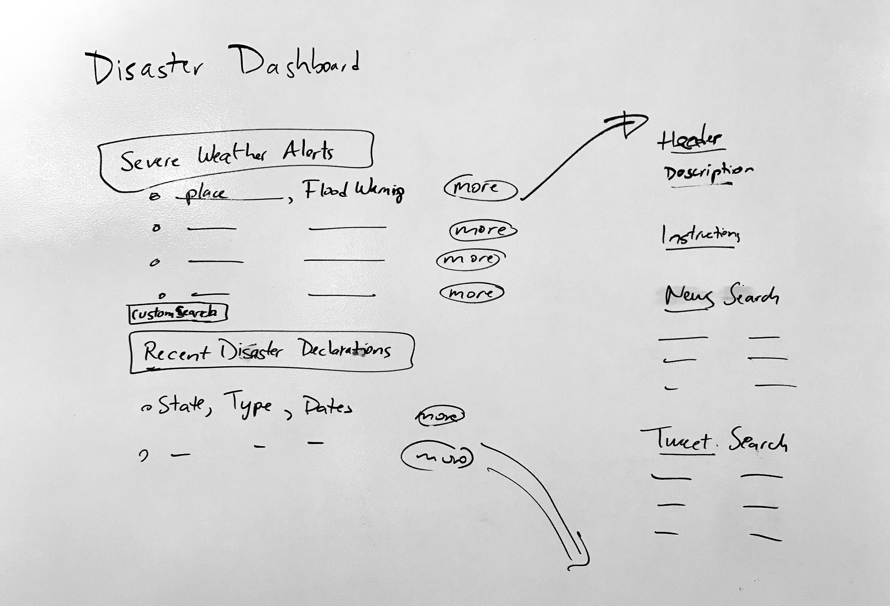

# Disaster Dashboards
## Leveraging News and Media for Situational Awareness (Problem #2)

---

### Team
 - Jonathan Ruiz
 - Paul Schimek
 - Michelle Cheung
 
 ### Project Description
---
During a major disaster, it is essential to provide the public and responders with relevant local news updates in order to gain situational awareness during the event. During a disaster, news updates are coming from tens to hundreds of different sources, all in different formats, available from different websites, news channels etc., and it is often difficult to find what would be most helpful amid the chaos of other non-disaster related news and media. There is currently no forum for rounding up and archiving relevant news for a live disaster event. This project will leverage news feeds relevant to specific disasters, gathered from multiple sources, to create a website that presents these live feeds in one dashboard.

The home page will include a list of live severe weather alerts and recent FEMA disaster declarations on the national level. Severe weather alerts will be shown by "Location" and "Type" of warning. Recent disaster declarations will be shown by type, name, date, and location. For each servere weather alert and recent disaster declatation, the user will be hyperlinked to a disaster specific dashboard with a description of the event, FEMA safety instructions, relevant news items, and relevant tweets. News items and relevant tweets will be sourced from NewsAPI, and the official Twitter API (and Twitterscapper for historical tweets), respectively. The home page and hyperlinked dashboards will be built using Flask, a micro web development platform written in Python. 

### Project Deliverables
---
1. Slideshow
2. Webscraper from at least 3 sources
3. Open source code for disaster-specific webpage
4. Short written description of project.
5. Classification models for classifying type of disaster and whether disaster is live or recent

### Data Sources
---
1. Federal Emergency Management Agency (FEMA) API
2. National Weather Service (NWS) API
3. News API
4. Twitter API
5. GetOldTweets3  https://pypi.org/project/GetOldTweets3/
