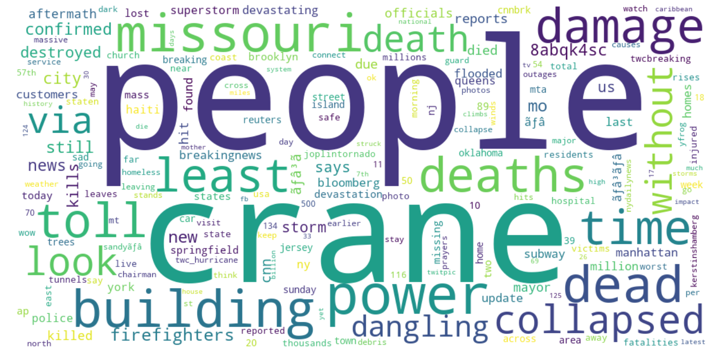
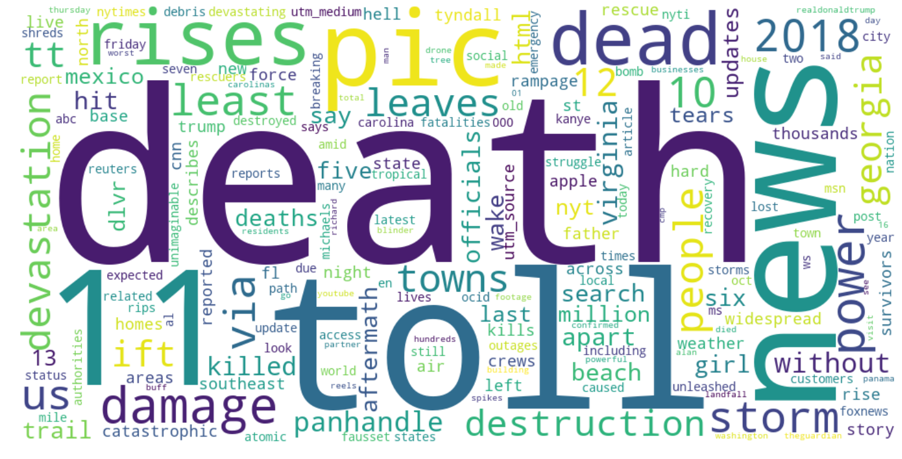
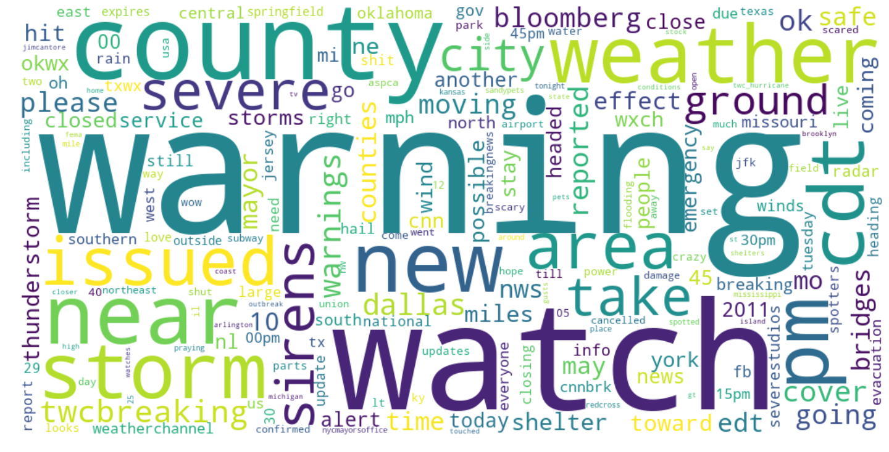
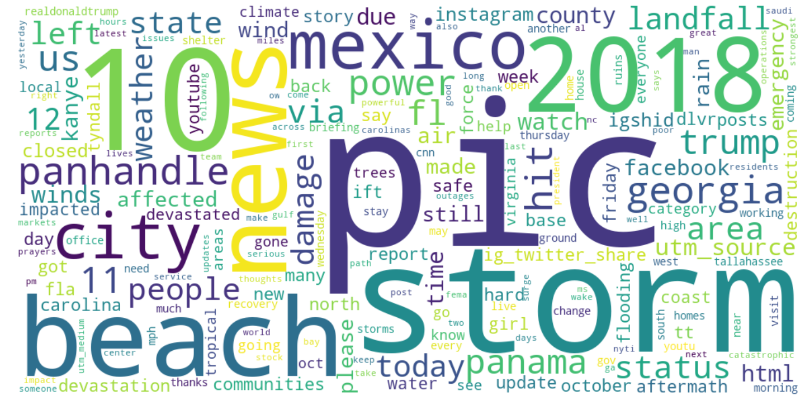
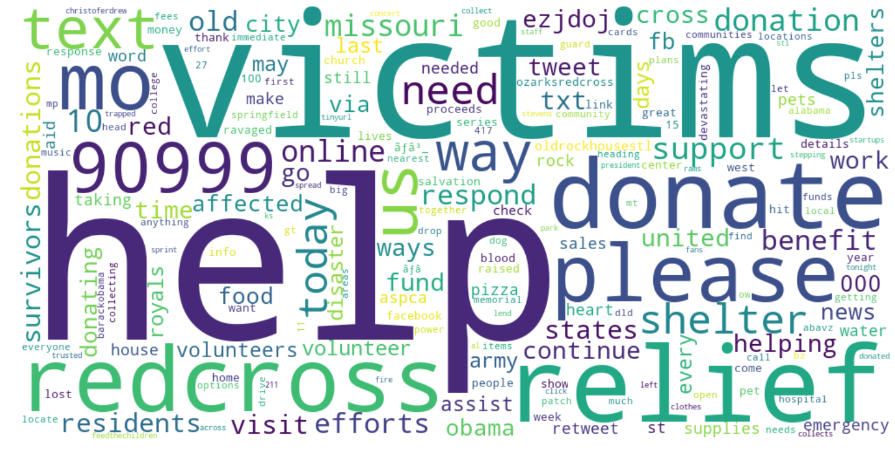
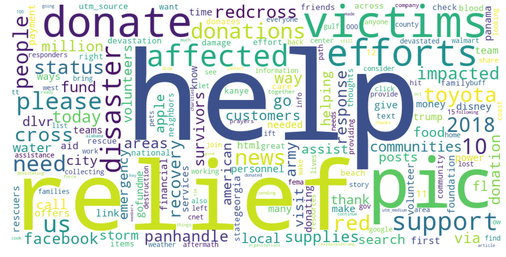

# Disaster Dashboards
## Leveraging News and Media for Situational Awareness (Problem #2)

---

### Team
  - Michelle Cheung
  - Jonathan Ruiz
  - Paul Schimek
 
 ### Links
  * [Public version of this repo](https://github.com/keencyclist/disaster) 
  * [Disaster Dashboard Demo, only renders in public verison](./templates/Dashboard.htm)
  * [Training data preparation notebook](./notebook/Training_Data.ipynb)
  * [Model estimation using training data from Hurricanes Harvey, Irma, and Maria](./notebooks/Models-Three_Hurricanes.ipynb)
  * [Model estimation using training data from Hurricane Sandy and Joplin Tornado](./notebooks/Models-Sandy_Joplin.ipynb)
  * [Notebook for Hurricane Michael Tweet data collection](./data/Hurricane_Michael_Tweets.ipynb)

  ### Comments from Each Team Member
---
1. [Michelle's comments](https://git.generalassemb.ly/MichelleC/dsi-7-submissions/blob/master/Project_4_submission/Project_4_MCheung_Tech_Report.ipynb)
2. [Jon's comments](https://docs.google.com/document/d/11U8SQtYu8Zo2rAhfRmzM5YQkyWft7M8eUlMe-YwnFUQ/edit?usp=sharing)
3. [Paul's comments](https://docs.google.com/document/d/1q6JQHFgpiOrZN3m5-uBsH7dgp6P-Io09-cmZ0-S0mtE/edit?usp=sharing)

 ### Project Description
---
During a major disaster, it is essential to provide the public and responders with relevant local news updates in order to gain situational awareness during the event. During a disaster, news updates are coming from tens to hundreds of different sources, all in different formats, available from different websites, news channels etc., and it is often difficult to find what would be most helpful amid the chaos of other non-disaster related news and media. There is currently no forum for rounding up and archiving relevant news for a live disaster event. This project consists of a method to identify tweets that might be relevant to an ongoing disaster, and creates a webpage that displays them in a dashboard.

### Objective
---
Social media can provide valuable real-time information to first responders, and relief workers, and the public during a disaster. However, informative signals are often clouded with irrelevant noise--especially on Twitter. This goal of this project was to find a means of separating out informative from noninformative tweets in order to provide a filtered list of tweets that are most likely to provide usable information. The tweets are displayed on a prototype online dashboard.  

### Procedure
---
We decided to create a model that could help identify tweets that provide useful, actionable information among a larger pool of tweets related to an ongoing disaster event. This approach requires a supervised learning model, which requires human-labeling of tweets for relevant content in order to train the model.

#### Testing Data
Numerous previous studies have catalogued disaster-related tweets and have used natural language processing techniques to identify relevant tweets include such methods as keyword and hashtag searches and geolocation. We found two sources of human-labeled tweets from previous studies:

  a. The first source consists of 9,465 tweets from "CrisisMMD: Multimodal Twitter Datasets from Natural Disasters1. Although other events were included in the source, we decided only to use tweets related to Hurricanes that affected the U.S. These included three events: Hurricane Irma (tweets dated circa Sept. 2017), Hurricane Harvey (tweets dated circa Aug. to Sept. 2017), and Hurricane Maria (tweets dated circa Sept. to Nov. 2017). Although this source provided a large number of human-labeled tweets, the authors of the original study selected only tweets that contained at least one image. These tweets were labeled as informative or not-informative based on whether a given tweet provided information for humanitarian aid purposes. The informative tweets were further classified as Infrastructure and utility damage, Individuals affected,
  Injured or dead people, Vehicle damage, Missing or found people, or other.

  b. An additional 3,121 tweets were taken from "Practical Extraction of Disaster-Relevant Information from Social Media"2, which included tweets related to the Joplin Tornado (tweets dated circa May 2011) and Hurrican Sandy (tweets dated circa Oct. 2012). These tweets were labeled as either Personal (if a message was only of interest to its author and her immediate circle of family/friends and does not convey anything useful), Informative (if the message was of interest to other people beyond the author’s immediate circle), or Other (if the message was not related to the disaster). The informative tweets were further classified as Casualties and damage, Caution and advice, Information Source, Donations of money, goods or services, People missing, found or seen, or unknown. (Note that this classification differs from the one used in the previous study.)

The source's description of the categories is as follows:

| Tweet Class | Description |
| --- | --- |
| **Not informative** | *Tweets which did not contain information valuable for disaster recovery and/or rescue.* |
| **Casualties and damage** | *Tweets which reported the information about casualties or damage done by an incident* |
| **Caution and advice** | *Tweets which conveyed/reported information about some warning or a piece of advice about a possible hazard of an incident.* |
| **Informative, other** | *Tweets included a message of interest to other people beyond the author's immediate circle.* |
| **Information source** | *Tweets which conveyed/reported some information sources like photo, footage, video, or mentions other sources like TV, radio related to an incident* |
| **Donations of money, goods, or services** | *Tweets which spoke about money raised, donation offers, goods/services offered or asked by the victims of an incident.* |

[Training data preparation notebook](./notebook/Training_Data.ipynb)

#### Model Results
Cleaning of the tweets included setting all alphabetical characters to lowercase, tweet string removal (ie: "RT"), duplicate removal, and use of *TweetTokenizer*, which truncates elongations and removed Twitter handles. The tweet text was then vectorized either by simple frequency (using CountVectorizer) or by term-frequency-inverse document frequency (using TfidfVectorizer). Several classification models were tested to find the most effective model. After model tuning, the logistic regression models had the highest accuracy. The tweets from the Sandy/Joplin dataset were more effective in training our model than if we used both the Sandy/Joplin dataset and the Irma/Harvey/Maria dataset. Subsequently, our final training model only used the Sandy/Joplin tweets.

Natural language processing included usage of TF-IDF and Countvectorizer, each separately with the Naive Bayes algorithm. Algorithms used were Logistic Regression, Support Vector Machine, Naive Bayes with TF-IDF, Naive Bayes with CountVectorizer, and Random Forest. Logistic regression yieleded the most successful model. 

#### Three Hurricanes Model 
[Model estimation using training data from Hurricanes Harvey, Irma, and Maria](./notebooks/Models-Three_Hurricanes.ipynb)

Model | Train | Test |
| --- | --- | --- |
| **Logistic Regression** | 0.96 | 0.71 |
| **Support Vector Machine** | 0.88 | 0.69 |
| **Naive Bayes w/TF-IDF** | 0.70 | 0.66 |
| **Naive Bayes w/CVEC** | 0.77 | 0.68 |
| **Random Forest** | 0.59 | 0.57 |

The logistic regression model had the highest accuracy. The table below shows the accuracy by category for the logistic regression. The important categories relating to casualties and damage and caution and advice show an accuracy greater than 0.5. Moreover, the model appears to be highly accurate in separating non-informative tweets. These figures are based on applying the model to a held-back 25% sample of the original data.

| Tweet Class | Accuracy with Logistic Regression Model |
| --- | --- |
| **Other relevant information** | 0.87 |
| **Rescue, volunteering, donation** | 0.80|
| **Infrastucture and unitily damage** | .38	|
| **Not relevant or can't judge** | .11 |
| **Affected individuals** | .06 |
| **Injured or dead people** | .56 |
| **Vehicle damage** | .56 |
| **Missing or found people** | .0 |

#### Sandy-Joplin Model
[Model estimation using training data from Hurricane Sandy and Joplin Tornado](./notebooks/Models-Sandy_Joplin.ipynb)

The classifier model results of different types are shown in the summary below.

| Model | Train | Test |
| --- | --- | --- |
| **Logistic Regression** | 0.88 | 0.68 |
| **Support Vector Machine** | 0.85 | 0.61 |
| **Naive Bayes w/TF-IDF** | 0.69 | 0.63 |
| **Naive Bayes w/CVEC** | 0.82 | 0.68 |
| **Random Forest** | 0.51 | 0.50 |

The logistic regression model had the highest accuracy. The table below shows the accuracy by category for the logistic regression. The important categories relating to casualties and damage and caution and advice show an accuracy greater than 0.5. Moreover, the model appears to be highly accurate in separating non-informative tweets. These figures are based on applying the model to a held-back 25% sample of the original data.

| Tweet Class | Accuracy with Logistic Regression Model |
| --- | --- |
| **Not informative** | 0.91 |
| **Casualties and damage** | 0.54|
| **Caution and advice** | .68|
| **Informative, other** | .13 |
| **Information source** | .43|
| **Donations of money, goods, or services** | .49 |
| **People missing, found or seen** | .36 |

#### Application of Model to Hurricane Michael Tweets
We tested the model on out-of-event data: tweets related to Hurricane Michael, the most recent hurricane that has been designated by FEMA. Tweets relating to Hurricane Michael were retrieved through the Python library "GetOldTweets3." These tweets were not labeled and were collected from a data range of October 9 through October 16, 2018 with a sole search term of "Hurricane Michael." Approximately 300,000 tweets were collected in total.

[Notebook for Hurricane Michael Tweet data collection](./data/Hurricane_Michael_Tweets.ipynb)

### Wordclouds

The following wordclouds compare tweets labeled as containing information on casualties. First, wordcloud using human-labeled tweets from Sandy and Joplin:

Second, these are tweets from Hurricane Michael that were predicted to be related to casualties using the model described above:

Here are wordclouds for tweets labeled as containing "Caution and Advice." First, wordcloud using human-labeled tweets from Sandy and Joplin:

By comparison, here is a wordcloud of tweets from Hurricane Michael that were predicted to be "caution and advice" tweets using the model described above:

Here are wordclouds for tweets labeled as requests for donations. First, wordcloud using human-labeled tweets from Sandy and Joplin:

By comparison, here are the predicted donations-related tweet word frequencies for Hurricane Michael:

### Dashboard
---
The dashboard was built with Flask, a micro web development platform for Python. The dashboard presents the top tweets from each of the categories (Casualties and Damage, Caution and Advice, Donations of money, goods, or services, and Information Source). Each tweet links  to the original post on the Twitter.com website.

### Conclusions
---
Twitter is an important source of real-time, micro-targeted information that has enormous potential for information discovery and dissemination during natural disasters. The challenge is determining which tweets have useful information among the information firehose that is Twitter. We found that we could leverage existing datasets of human-labeled disaster-related tweets to develop a model to identify those tweets that have generally relevant information. Although the overall accuracy of the model on withheld testing data was only moderate, it had more than 90% accuracy in separating informative and non-informative tweets using the Sandy-Joplin data. Further, when applied to out-of-event data (tweets related to Hurricane Michael), the model seems to do a reasonable job at finding informative tweets and in identifying certain specific types such as those refering to requests for donations or those retweeting news, photos, or videos from established media.
We could improve the model by establishing more generalizable categories of emergency-related tweets and label more training data. It would also be useful to review a sample of at least a few hundred out-of-event cases to provide a better indication of the accuracy of the model on a real-time stream of tweets. One could also expand the model to include other natural disaster types, aside from hurricanes or tornados.

### Data Sources
---
1. CrisisMMD: Multimodal Twitter Datasets from Natural Disasters: Firoj Alam, Ferda Ofli, Muhammad Imran
Qatar Computing Research Institute, HBKU, Doha, Qatar
2. Practical Extraction of Disaster-Relevant Information from
Social Media: Muhammad Imran (University of Trento), Shady Elbassuoni (American University of Beirut), Carlos Castillo (Qatar Computing Research Institute), Fernando Diaz (Microsoft Research), Patrick Meier (Qatar Computing Research Institute)
3. GetOldTweets3  https://pypi.org/project/GetOldTweets3/
